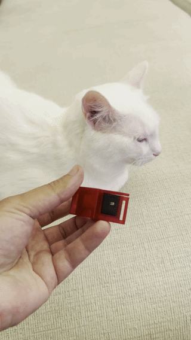
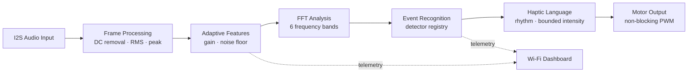

<div align="center">


[](https://github.com/fbeser/VibHearing/stargazers)
[](https://github.com/fbeser/VibHearing/commits)

# VibHearing

### An open-source wearable platform that translates meaningful environmental sounds into an intuitive haptic language.

[Why VibHearing?](#why) · [How it works](#software-architecture) · [Current status](#current-status) · [Roadmap](ROADMAP.md) · [Contributing](#contributing)

</div>

> [!IMPORTANT]
> VibHearing is not simply a smart cat collar. It is an experimental sensory-substitution platform designed to support multiple kinds of wearable devices and research.

VibHearing listens for meaningful acoustic events, extracts compact signal features, and maps recognized events to consistent vibration patterns. It does **not** try to reproduce sound. Instead, it explores whether a small, learnable haptic vocabulary can make important events easier to notice.



*Early wearable prototype demonstrating the current collar form factor.*

The current prototype focuses on a wearable for deaf and hard-of-hearing cats. The same modular firmware architecture can also support research involving:

- deaf cats and other animal-welfare applications;
- deaf and hard-of-hearing people;
- accessible and assistive wearables; and
- sensory-substitution and haptic-communication studies.

## Why?

Millions of humans and animals cannot rely on hearing to understand what is happening around them. Conventional approaches often focus on amplifying or recreating audio, but that is not the only possible interface.

VibHearing explores a different question:

> Can meaningful environmental events be translated into a small, consistent vibration language that a wearer can learn over time?

The objective is not to transmit every sound. It is to communicate a carefully selected set of useful events while minimizing surprise, unnecessary vibration, and false certainty.

## Vision

VibHearing is a platform rather than a single finished product. A shared audio-to-haptics firmware foundation could eventually power:

| Research direction | Possible form |
|---|---|
| Animal accessibility | Smart collar for deaf cats |
| Human accessibility | Wristband for deaf and hard-of-hearing people |
| Industrial awareness | Wearable machine and process notifications |
| Academic research | Reconfigurable sensory-substitution hardware |
| Haptic interfaces | Non-audio communication devices |

These are future research directions, not validated product claims. Each use case will require its own hardware, safety limits, datasets, and user studies.

## Features

- [x] Real-time 16 kHz I2S audio capture
- [x] RMS, peak, adaptive gain, and noise-floor features
- [x] Dependency-free, Hann-windowed 256-point FFT
- [x] Six frequency bands from approximately 60 Hz to 8 kHz
- [x] Pluggable event-detector registry
- [x] Heuristic human voice-activity candidate detection
- [x] Continuous-machinery rejection and environmental-sound telemetry
- [x] Non-blocking haptic language engine
- [x] Bounded, signal-strength-dependent motor intensity
- [x] Motor self-noise feedback suppression during haptic playback
- [x] Live Wi-Fi development dashboard and JSON APIs
- [x] Validated, volatile runtime tuning controls
- [x] Modular C++17 firmware for the XIAO ESP32-C3
- [x] PlatformIO build configuration
- [x] Stable detector interface for future TinyML integration
- [ ] Trained and evaluated TinyML classifier
- [ ] Calibrated multi-event recognition
- [ ] Production-ready hardware and enclosure

## Current status

> [!WARNING]
> VibHearing is an experimental research prototype. Code presence does not mean that a feature has been scientifically or behaviorally validated.

| Area | Current state |
|---|---|
| Controller | Seeed Studio XIAO ESP32-C3 |
| Audio input | One MSM261S4030H0 I2S microphone |
| Haptic output | One coin vibration motor on the left channel |
| Recognition | Sensitivity-tuned, uncalibrated human voice-activity heuristic |
| Actuation policy | Only `human_voice` may activate the motor |
| Other sound classes | Machinery veto and environmental fallback are telemetry-only; other experimental classifiers are disabled |
| Dashboard | Working development UI on a trusted local Wi-Fi network |
| TinyML | Interface is ready; no trained model is integrated |
| BLE | Service boundary exists; radio initialization is disabled |
| Battery sensing | Disabled until circuitry, calibration, and policy are defined |
| Validation | Build, upload, and short runtime smoke tests completed; controlled acoustic, electrical, enclosure, and behavioral tests remain |

The label `human_voice` means that a frame sequence matches the current voice-activity heuristic. It does not identify words, speakers, or semantic meaning, and it is not yet a reliable source classifier.

## Working Demo

[Watch the working prototype demo](assets/vibhearing-working-demo.mp4)

The demo shows live audio telemetry, provisional human-voice detection, and haptic motor activation on the development hardware.

> [!NOTE]
> This video is a proof of concept for an experimental sensory-substitution prototype, not evidence of reliability or product safety. VibHearing is not a medical hearing device, and its human-voice detection remains an uncalibrated heuristic. The wearable footage demonstrates the early collar form factor only; it should not be interpreted as an active-motor test on an animal.

## Hardware

### Current prototype

| Component | Role | Connection / status |
|---|---|---|
| Seeed Studio XIAO ESP32-C3 | Main controller | Active |
| MSM261S4030H0 | Mono I2S microphone | BCLK `GPIO4`, WS `GPIO5`, DATA `GPIO6` |
| Coin vibration motor | Haptic output | Left channel, PWM on `GPIO7` |
| IRLML6344 MOSFET | Motor switching | Active prototype component |
| 3.7 V LiPo | Portable power concept | Runtime and enclosure behavior not yet validated |
| Right motor channel | Future output | `GPIO21` reserved; disabled |

The motor PWM runs at 1 kHz with 8-bit resolution. Firmware currently caps haptic commands at 180/255, but this is **not** a calibrated mechanical or biological safety limit.

> [!CAUTION]
> Use an appropriate flyback-protection circuit and verify motor current, MOSFET temperature, EMI, battery behavior, and mechanical vibration on the bench. Never test an energized motor while the collar is worn by an animal.

See [SPEC.md](SPEC.md) for the complete pin map and technical constraints.

## Software architecture



The main boundaries are intentionally replaceable:

- `AudioEngine` captures frames and produces stable `AudioFeatures`.
- `AudioEventRecognizer` compares independent `AudioEventDetector` implementations.
- `HapticEncoder` converts accepted events into non-blocking motor patterns.
- Hardware drivers and services remain independent of concrete detector logic.

A future statistical or quantized TinyML detector can implement `AudioEventDetector` and join the registry without redesigning the capture, recognition, dashboard, or haptic layers. “TinyML ready” describes this software boundary; it does not mean that a trained model currently ships with the project.

## Haptic language

VibHearing represents event meaning primarily through **rhythm**, while received acoustic strength controls intensity within conservative firmware bounds. The current human-voice prototype uses two short pulses. Signal strength is relative to the adaptive noise floor and must not be interpreted as physical distance.

The vocabulary is designed around a few stable associations rather than continuous vibration or one pattern for every possible sound. Read [Haptic Language](docs/HAPTIC_LANGUAGE.md) for timing, learning stages, research constraints, and proposed patterns.

## Web dashboard

The device hosts a dependency-free development dashboard at:

```text
http://vibhearing.local/
```

It provides:

- a live, normalized 256-sample waveform;
- six FFT-band visualizations;
- RMS, peak, adaptive gain, noise floor, and signal-to-noise telemetry;
- current event, confidence, and acoustic-strength output;
- Wi-Fi status, RSSI, and uptime; and
- runtime controls for voice thresholds, motor bounds, retrigger timing, and telemetry.

> 📷 **Dashboard screenshot placeholder** — an overview image will be added after the UI and enclosure workflow stabilize.

Runtime settings are validated but volatile: they return to compiled defaults after a reboot. The dashboard is unauthenticated and unencrypted, so it must only be used on a trusted development LAN. Do not expose it through port forwarding.

<details>
<summary><strong>Build, upload, and open the dashboard</strong></summary>

### Requirements

- [PlatformIO](https://platformio.org/) Core or IDE extension
- Seeed Studio XIAO ESP32-C3
- Supported I2S microphone wiring
- Properly switched and protected motor circuit

### 1. Configure local Wi-Fi credentials

Copy `include/WifiSecrets.example.h` to `include/WifiSecrets.h`, then enter the SSID and password for a trusted development network. The real secrets file is intentionally ignored by Git.

### 2. Build

```sh
pio run
```

### 3. Upload

```sh
pio run --target upload
```

### 4. Monitor

```sh
pio device monitor
```

The serial output reports the DHCP address after connection. Open that address or `http://vibhearing.local/` in a browser on the same network.

</details>

## Project philosophy

VibHearing is guided by a few non-negotiable engineering principles:

| Principle | What it means here |
|---|---|
| 🛡️ Safety first | Optional or electrically undefined hardware defaults to disabled. |
| 🐾 Animal welfare | Any animal study requires expert guidance, gradual introduction, supervision, and immediate stop conditions. |
| 📏 Measured claims | A successful compile or smoke test is not treated as classifier, electrical, or behavioral validation. |
| 🔬 Scientific validation | Thresholds and models should be evaluated with labeled target-hardware data and explicit metrics. |
| 🔓 Open research | Design decisions, limitations, and unresolved problems are documented for review and collaboration. |
| 🧩 Modular design | Audio, recognition, haptics, drivers, and services have replaceable boundaries. |
| 🧰 Maintainability | Safe defaults, centralized configuration, and stable interfaces take priority over demos that are hard to reproduce. |
| 🔒 Privacy by design | Compact feature telemetry is preferred over retaining private household audio. |

VibHearing intentionally avoids claims that have not been experimentally verified. Known limitations and unsuccessful tests are part of the engineering record, not details to hide.

## Roadmap

Development progresses from bench-safe hardware and reliable signal processing toward labeled datasets, calibrated recognition, carefully reviewed haptic studies, secure connectivity, TinyML evaluation, and only then production engineering.

See the complete, evidence-based [Roadmap](ROADMAP.md). Its checkboxes represent verified outcomes, not merely code that exists.

## Documentation

| Document | Purpose |
|---|---|
| [README.md](README.md) | Project overview and entry point |
| [SPEC.md](SPEC.md) | Hardware, firmware, signal-processing, and safety specification |
| [ROADMAP.md](ROADMAP.md) | Validation-driven development plan |
| [CHANGELOG.md](CHANGELOG.md) | Notable project changes |
| [Development Journal](AGENTS.md) | Test evidence, open problems, decisions, and session history |
| [docs/HAPTIC_LANGUAGE.md](docs/HAPTIC_LANGUAGE.md) | Haptic vocabulary and responsible learning principles |

## Contributing

Thoughtful contributions are welcome. You can help by:

- opening an issue with a reproducible bug or a clearly scoped proposal;
- improving firmware, tests, documentation, or accessibility;
- contributing labeled test methodology and signal-analysis expertise;
- reviewing electrical, embedded, animal-welfare, privacy, or human-factors assumptions; or
- discussing how to evaluate haptic cues without overstating outcomes.

Please read the specification and roadmap before changing safety-sensitive behavior. Pull requests should describe what was tested, on which hardware, and what still requires physical validation.

## Support the project

- ⭐ [Star this repository](https://github.com/fbeser/VibHearing) to follow its progress.
- ❤️ **Buy Me a Coffee** — coming soon.

## Disclaimer

VibHearing is an **experimental research project**. It is not:

- a medical device;
- a certified hearing aid; or
- a life-safety or emergency-warning system.

Do not rely on VibHearing in life-critical situations. The prototype has not completed the electrical, mechanical, behavioral, clinical, accessibility, radio, battery, or regulatory validation required for a finished product.

---

<div align="center">

**VibHearing explores a simple idea: important sound does not always have to remain sound.**

</div>
